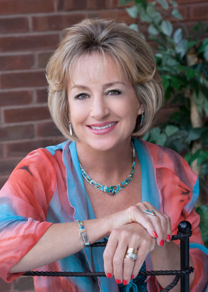

# About Me

## Philosophy

Throughout our lives, we encounter challenges that strain our ability to cope. Like a storm at sea, these experiences can be overwhelming, and threaten to leave us immobilized.  At these times, we can respond as a skillful sailor, adjusting course and adapting new methods to navigate even the most formidable waters.

There are ways to manage the most intense experiences:  death, separation, divorce, job loss, depression, anxiety, family dysfunction, relationship issues, loneliness.  Each person and each situation is unique, requiring a diversity of creative approaches. 

As a nurse psychotherapist I conduct a practice of therapy and consultation with the goal of assisting individuals, families, and groups to progress more effectively through demanding phases of life.  I strive to form a relationship with those seeking my assistance that allows for the exploration and understanding of the presenting issues, and the development of the capacity to negotiate the storms of life transitions.

## Background

Following a career as a community health nurse in Germany and as a nurse practitioner in a variety of settings, then as a clinical nurse specialist in oncology and later as a psychiatric liaison at the National Institutes of Health (NIH) I became an educator and the director of a graduate nursing program at the University of Maryland. I entered the field of psychotherapy as the co-director of the children's program and grief therapist at the St. Francis Center, formerly the center for loss and grief in Washington, DC.

I have developed and currently facilitate a private practice of psychotherapy, consultation, and supervision.  I am an educator, author, lecturer, and qualitative researcher.  I provide psychotherapy for children, adolescents, adults, couples, families and groups. I believe that the relationship between the therapist and client is pivotal, and I strive to facilitate the development of  the trust that is the essential foundation for the work that is to be done together.  I also maintain that the setting for the practice of psychotherapy is significant.  I have a [residential practice](office.html) that allows me to incorporate space, light, music, a variety of projective tools, as well as the out-of doors to promote the development of insight and change.

### Certifications
I am a certified pediatric nurse practitioner, clinical specialist in both child and adult psychiatric and mental health nursing, and certified practitioner of Ericksonian Hypnotherapy.

### Memberships
I am currently Associate Director for Member Relations, Coordinator for Membership, and a faculty member for the Psychotherapy Program of the Institute of Contemporary Psychotherapy and Psychoanalysis (ICP+P). I am a member of the American Nurses Association (ANA), the District of Columbia Nurses Association (DCNA), The Association for Death Education and Counseling (ADEC), the National Association for Poetry Therapy (NAPT) and Nurse Practitioner Association of the District of Columbia (NPADC).

### Publications

- Gibbons, Martha Blechar. Psychosocial Aspects of Serious Illness in Childhood and Adolescence: Responding to the Storm. In Ann Armstrong &amp; Sarah Zarbock (Eds.) Hospice Care of Children, Third Edition. Oxford University Press. 2008.
- Gibbons, Martha Blechar. *Going home.*  Voices:  The Art and Science of Psychotherapy, Volume 41, Winter 2005.
- Gibbons, M. B.  *Leaning on impermanence*.  Voices:  The Art and Science of Psychotherapy, Volume 38, Summer 2002.
- Gibbons, Martha Blechar.  *Divorce and the American family*.  Centering.  St. Francis Center, Spring, 1998.
- Gibbons, M. B.  *Nurse psychotherapist*.  The Nursing Spectrum, Volume 5, Number 2, January 23, 1995.
- Gibbons, M.B. *Listening to the lived experience of loss*.  Pediatric Nursing, November/December 1993, pp. 597-599.
- Gibbons, M. B., *Sharing secrets:  group support for bereaved children*.  Journal of Pediatrics and Health Child Health, 1993, p A51.
- Gibbons, M.B.  Psychosocial perspectives of serious illness in childhood and adolescence.  In S. Goltzer and A. Daily (Eds).  *Hospice Care for Children*, Oxford University Press, 1993.
- Gibbons, M.B.  *A child dies, a child survives:  the impact of sibling loss*. Journal of Pediatric Health Care, March/April 1992, pp. 65-72.
- Gibbons, M.B.  *Sibling loss in childhood and adolescence*.  Health Care, March/April 1992, pp. 65-72.
- Gibbons, M.B.  Coping with cancer in childhood:  support for the family system.  In B. Broecker and F. Klein (Eds.), *Tumors of the Genitourinary Tract*.  Churchill Livingston, 1988.
- Power, P., Dell Orto, A., &amp; Gibbons, M.  *Illness and Disability:  Family Interventions.*  Springer, 1988.
- Gibbons, M.B.  *When the dying patient is a child:  a challenge for the living*.  In M. Hockenberry and D. Coody (Eds.)  Hematology/Oncology:  Perspectives in Care . C. V. Mosby, 1986.
- Gibbons, M.B.  Guest Editor, *Pediatric oncology*, Nursing Clinics of North America.  March 1985.
- Gibbons, M.B., and Boren, H. *A spectrum of strategies in pediatric oncology nursing*.  Nursing Clinics of North America.  March 1985.
- Gibbons, M.B.  *Circumcision:  the controversy continues*. Pediatric Nursing, March/April 1984, pp203-209.
- Gibbons, M.B. &amp; Leonard, J.  *Working with the sole parent in the military community*.  Medical Bulletin, December 1982, pp. 30-39.
- Gibbons, M.B.  *Why circumcise?*  Pediatric Nursing, July/August 1979, pp. 19-22.
- Gibbons, M.B.  *When parents ask about play*.  Pediatric Nursing, November/December 1977, pp. 9-12.

### Honors

- Selected as a “Visionary Nursing Leader,” Virginia Commonwealth School of Nursing, May 2013
- *Washingtonian* - Top Therapists as Chosen by Their Peers. July 2009.
- *Washingtonian* - Special Section:  Counselors Who Can Help. September 11, 2001.
- Community Service Award - 9/11 Survivor Support Groups. 2001.
- *Sigma Theta Tau National* Nursing Honor Society 
- *Who's Who in American Nursing*
- *Who's Who in the East*
- *The World Who's Who of Women*
