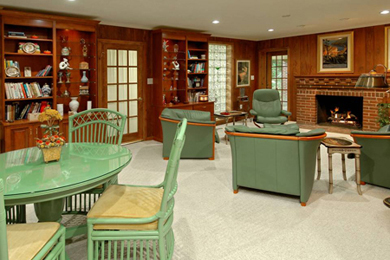
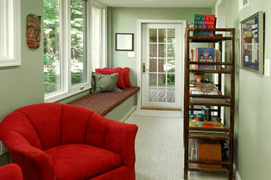

# My office

  

    

      

        
        
Consultation area

      

    

    

      

        
        
Consultation area

      

    

    

      

        
        
Waiting room

      

    

    

      

        
        
Consultation area

      

    

    

      

        
        
Waiting room

      

    

    

      

        
        
Consultation area

      

    

    

      

        
        
Sand Tray/Projective Techniques Area with Shelved Miniatures

      

    

    

      

        
        
Entrance and exit

      

    

  

